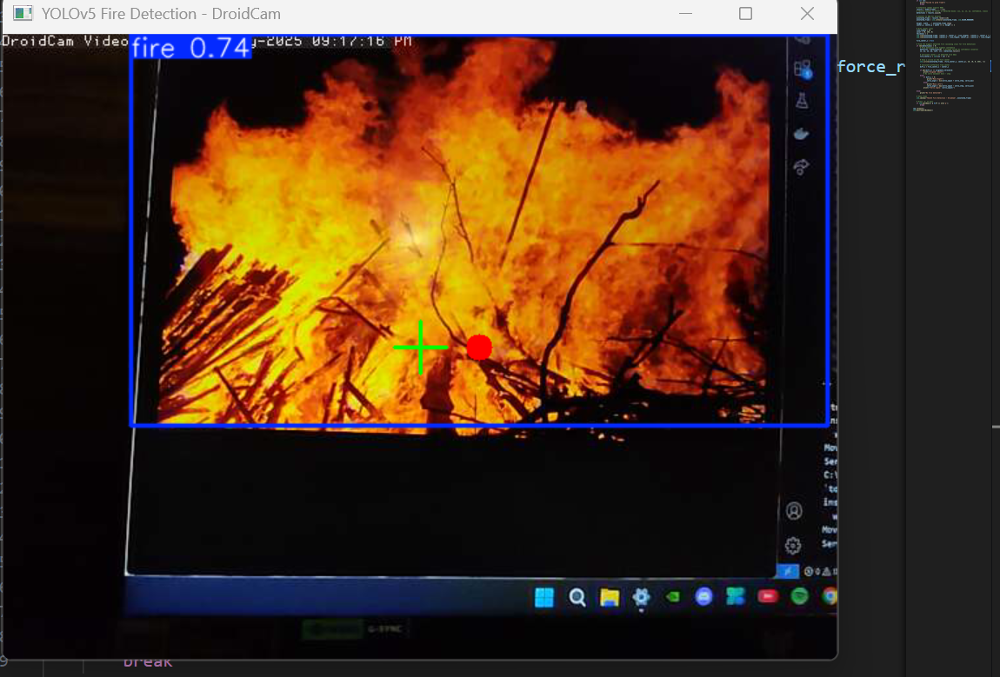

Autonomous Water Turret IoT for Fire Detection and Suppression
==============================================================

Welcome to the Autonomous Water Turret IoT project! This repository contains the code and resources for building an intelligent fire detection and suppression system. Leveraging computer vision (YOLOv5s) for fire detection, object tracking to pinpoint the fire's location, and an Arduino-based water turret for automated suppression, this project demonstrates a complete end-to-end solution for rapid response to fire incidents.

## Demos

### YOLOv5 Fire Detection Demo
  
*Real-time fire detection using a custom-trained YOLOv5s model.*

### Object Tracking Demo
  
*Tracking the fire location smoothly, even when the flame flickers or moves.*

### Turret Control Demo
  
*Arduino-based water turret automatically aims and suppresses the fire.*


Table of Contents
-----------------
- [Introduction](#introduction)
- [Features](#features)
- [System Architecture](#system-architecture)
- [Components](#components)
  - [1. Fire Detection with YOLOv5s](#1-fire-detection-with-yolov5s)
  - [2. Object Tracking](#2-object-tracking)
  - [3. Turret Control (Arduino)](#3-turret-control-arduino)
- [Demos](#demos)
- [Setup and Installation](#setup-and-installation)
  - [Software Setup](#software-setup)
  - [Arduino IDE Setup](#arduino-ide-setup)
  - [Hardware Setup](#hardware-setup)
- [Usage](#usage)
- [Contributing](#contributing)
- [License](#license)

Introduction
------------
In an emergency, every second counts. Traditional fire detection systems often rely on smoke or heat sensors, which might not provide precise location data for immediate suppression. This project introduces an autonomous system that uses real-time video feeds to visually identify fires, track their movement, and precisely aim a water turret to extinguish them, enhancing early response capabilities.

Features
--------
- Real-time Fire Detection: Utilizes a custom-trained YOLOv5s model for accurate and fast fire detection from camera streams.
- Robust Object Tracking: Implements object tracking algorithms to maintain a lock on detected fires, even with minor movements.
- Autonomous Turret Control: An Arduino-based system receives coordinates and controls servos/motors to accurately aim the water turret.
- Modular Design: Separated components for vision, tracking, and hardware control allow for easy scalability and integration.
- IoT Integration (Implied): Designed to operate as part of a larger IoT ecosystem for alerts and remote monitoring.

System Architecture
-------------------
The system operates in a streamlined manner:

1. **Video Stream Input**: A camera captures real-time video footage of the environment.
2. **Fire Detection Module**: The YOLOv5s model processes the video frames to detect fire instances.
3. **Tracking Module**: Upon detection, an object tracking algorithm tracks the centroid of the detected fire bounding box.
4. **Coordinate Calculation**: The tracking module calculates the necessary pan and tilt angles to aim the turret at the tracked fire.
5. **Serial Communication**: These angles are sent via serial communication to the Arduino microcontroller.
6. **Turret Actuation**: The Arduino code translates the received angles into servo motor commands, directing the water turret.

Components
----------
### 1. Fire Detection with YOLOv5s
- **Model Training**: The `yolov5s_fire_detection` folder contains configurations and training logs.
- **Inference Script**: `fire_detection.py` loads YOLOv5s weights and performs detection.

### 2. Object Tracking
- **Purpose**: Ensures tracking continuity of fire targets.
- **Implementation**: `tracking_system/tracker.py` handles the tracking logic.

### 3. Turret Control (Arduino)
- **Communication**: Uses serial communication to receive commands from Python.
- **Actuation**: Controls servo motors and the water pump for fire suppression.
- **Code**: Arduino sketch is in `arduino_code/arduino_turret_control.ino`

Demos
-----
- Fire Detection: `assets/yolov5_fire_demo.gif`
- Object Tracking: `assets/object_tracking_demo.gif`
- Turret Control: `assets/turret_control_demo.gif`

Setup and Installation
----------------------

### Software Setup

1. Clone the Repository:
```bash
git clone https://github.com/mohanchandrass/Autonomous-Water-Turret-IoT.git
cd Autonomous-Water-Turret-IoT
```

2. Create a Virtual Environment:
```bash
python3 -m venv venv
source venv/bin/activate
```

3. Install Python Dependencies:
```bash
pip install -r requirements.txt
# Or manually:
# pip install torch torchvision torchaudio opencv-python numpy serial ultralytics
```

### Arduino IDE Setup
- Open `arduino_code/arduino_turret_control.ino`
- Upload to your Arduino after configuring your board and port

### Hardware Setup
- Arduino (Uno/Mega/etc.)
- Servo Motors (Pan & Tilt)
- Water Pump + Nozzle + Relay
- Camera Module
- Power Supply
- Mounting Turret Hardware

Usage
-----
1. Connect Arduino and power your servos/pump.
2. Activate virtual environment:
```bash
source venv/bin/activate
```
3. Run the fire detection script:
```bash
python3 fire_detection.py
```

**Note**: Adjust serial port in `fire_detection.py` as needed (e.g., `/dev/ttyUSB0` or `COM3`).

Contributing
------------
1. Fork the repository
2. Create your feature branch: `git checkout -b feature/AmazingFeature`
3. Commit changes: `git commit -m 'Add some AmazingFeature'`
4. Push to branch: `git push origin feature/AmazingFeature`
5. Open a Pull Request

License
-------
MIT License (or specify yours)
